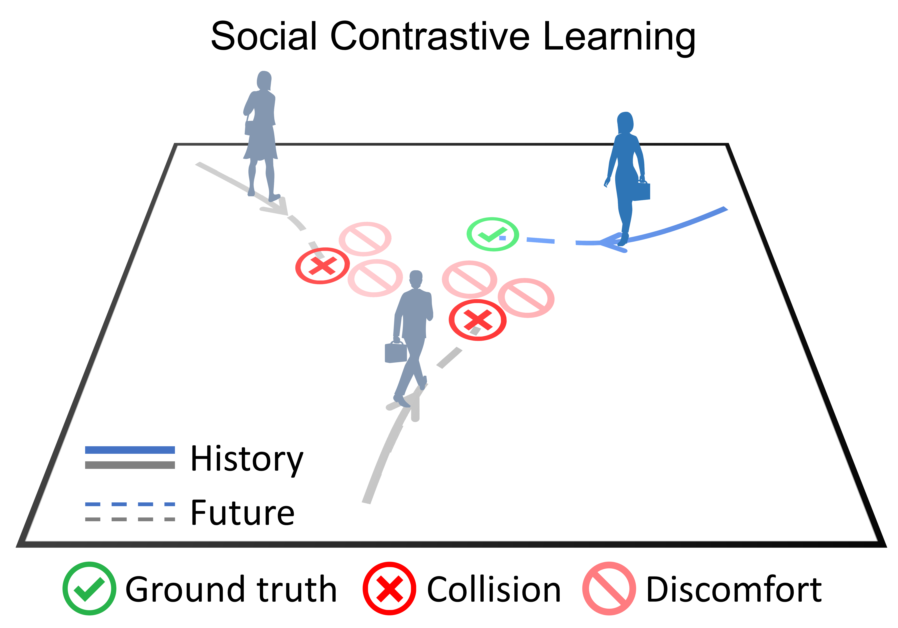
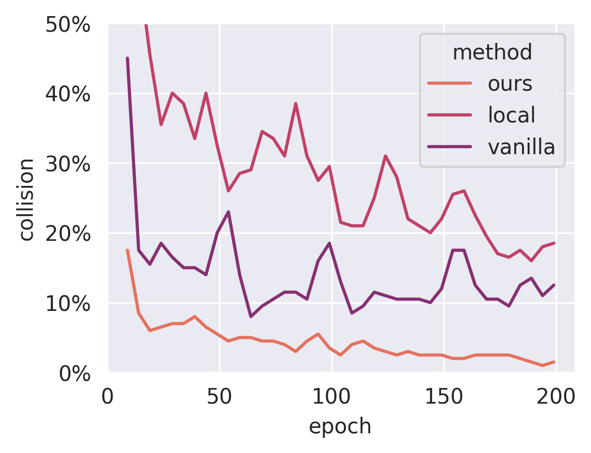

## Social NCE: Contrastive Learning of Socially-aware Motion Representations

<p align="center">
  
</p>

This is a PyTorch implementation for the paper 

**[Social NCE: Contrastive Learning of Socially-aware Motion Representations](https://arxiv.org/abs/2012.11717)**
<br>by
<a href="https://sites.google.com/view/yuejiangliu/">Yuejiang Liu</a>,
<a href="https://qiyan98.github.io/">Qi Yan</a>,
<a href="https://people.epfl.ch/alexandre.alahi/?lang=en/">Alexandre Alahi</a> at
<a href="https://www.epfl.ch/labs/vita/">EPFL</a>
<br>

Please check out the following repositories for experiments on different models:  
**[Social NCE + CrowdNav](https://github.com/vita-epfl/social-nce-crowdnav)  |  [Social NCE + Trajectron++](https://github.com/YuejiangLIU/social-nce-trajectron-plus-plus)  |  [Social NCE + STGCNN](https://github.com/qiyan98/social-nce-stgcnn)**

**TL;DR: Contrastive Representation Learning + Negative Data Augmentations &#129138; Robust Neural Motion Models**
> * Rank in 1st place on the [Trajnet++ forecasting challenge](https://www.aicrowd.com/challenges/trajnet-a-trajectory-forecasting-challenge/leaderboards) since November 2020
> * Significantly reduce the collision rate of SOTA [human trajectroy predictors](https://github.com/StanfordASL/Trajectron-plus-plus)
> * SOTA on imitation / reinforcement learning for [autonomous navigation in crowds](https://github.com/vita-epfl/CrowdNav)

### Preparation

Setup environments follwoing the [SETUP.md](docs/SETUP.md)

### Training & Evaluation

* Behavioral Cloning (Vanilla)
  ```
  python imitate.py --contrast_weight=0.0 --gpu
  python test.py --policy='sail' --circle --model_file=data/output/imitate-baseline-data-0.50/policy_net.pth
  ```
* Social-NCE + Conventional Negative Sampling (Local)
  ```
  python imitate.py --contrast_weight=2.0 --contrast_sampling='local' --gpu
  python test.py --policy='sail' --circle --model_file=data/output/imitate-local-data-0.50-weight-2.0-horizon-4-temperature-0.20-nboundary-0-range-2.00/policy_net.pth
  ```
* Social-NCE + Safety-driven Negative Sampling (Ours)
  ```
  python imitate.py --contrast_weight=2.0 --contrast_sampling='event' --gpu
  python test.py --policy='sail' --circle --model_file=data/output/imitate-event-data-0.50-weight-2.0-horizon-4-temperature-0.20-nboundary-0/policy_net.pth
  ```
* Method Comparison
  ```
  bash script/run_vanilla.sh && bash script/run_local.sh && bash script/run_snce.sh
  python utils/compare.py
  ```

### Basic Results

Results of behavioral cloning with different methods.

  

Averaged results from the 150th to 200th epochs.

<table><tbody>
<!-- START TABLE -->
<!-- TABLE HEADER -->
<th valign="bottom"></th>
<th valign="bottom">collision</th>
<th valign="bottom">reward</th>
<!-- TABLE BODY -->
<tr><td align="left">Vanilla</td>
<td align="center">12.7% &#177; 3.8%</td>
<td align="center">0.274 &#177; 0.019</td>
<tr><td align="left">Local</td>
<td align="center">19.3% &#177; 4.2%</td>
<td align="center">0.240 &#177; 0.021</td>
<tr><td align="left">Ours</td>
<td align="center">2.0% &#177; 0.6%</td>
<td align="center">0.331 &#177; 0.003</td>
</tr>
</tbody></table>

### Citation

If you find the code useful for your research, please cite our following papers:

```bibtex
@article{liu2020snce,
  title   = {Social NCE: Contrastive Learning of Socially-aware Motion Representations},
  author  = {Yuejiang Liu and Qi Yan and Alexandre Alahi},
  journal = {arXiv preprint arXiv:2012.11717},
  year    = {2020}
}
@inproceedings{chen2019crowdnav,
    title={Crowd-Robot Interaction: Crowd-aware Robot Navigation with Attention-based Deep Reinforcement Learning},
    author={Changan Chen and Yuejiang Liu and Sven Kreiss and Alexandre Alahi},
    year={2019},
    booktitle={ICRA}
}
```
